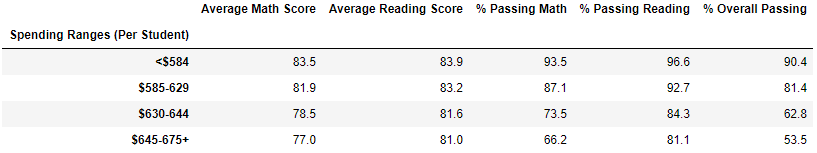

# School District Analysis

## Overview of Project
The purpose of the analysis was to get a summary of high school performance based on student budget, school size, and school type. Math and reading scores for Thomas High School (THS) in particular were altered, so that data had to be cleaned by replacing all the test scores with NaN values.

## School District Results
- **How is the district summary affected?**  
The entire district has a total of 39,170 students. THS has a total student body of 1,635 students (9th-12th grade), with 461 of those students being 9th graders. Percentage-wise, those THS 9th graders account for 1.18% of all students in the district and 28.20% of all students at THS. District averages for math and reading scores changed from 81.88% and 78.96% to 78.93% and 81.86%, respectively. Math scores decreased while reading scores increased.
 
 

- **How is the school summary affected?**  
THS' summary was affected for both math and reading scores. If the 9th grade scores were not cleaned from the dataset, then the percentage of overall students that passed math and reading was 65.08%. After cleaning the data to remove 9th graders, the overall percentage of students that passed both math and reading increased to 90.63%. 

- **How does replacing the ninth graders’ math and reading scores affect Thomas High School’s performance relative to the other schools?**  
Out of 15 schools in the district, THS was ranked 8th before replacement of falsified scores. After the scores were omitted, THS ranked 2nd in the district. 

- **How does replacing the ninth-grade scores affect the following:**  

    - **Math and reading scores by grade**  
    There were no results obtained for 9th graders at THS since all of the scores were falsified. All other schools have percentage data for every grade. 
    
    
    - **Scores by school spending**  
    School spending was split into four bins. From the data, schools schools that spent less actually had the highest overall pasing percentage. THS spends an average of $630-644 per student, so removing the ninth-grade scores would not change the difference between overall passing percentage by school spending. 
    
    
    - **Scores by school size**  
    School sizes were split into three bins: <1000, 1000-2000, and 2000-5000. From the data, schools with a student body >2000 had the lowest average math and reading scores as well as the lowest overall passing % at 58.3%. THS has a studen body of 1000-2000, so removing the ninth-grade scores would not change the difference between average scores by school size. 
    
    
    - **Scores by school type**  
    Charter schools showed to have a 6.5% higher average math score and a 2.9% higher average reading score than district schools. THS is a charter school, so removing the ninth-grade scores would not change the difference between average scores by school type. 
    
    

## School District Analysis Summary
The results of the analysis showed that after the math and reading scores for ninth-graders at THS were replaced, there was no significant change to any of the data. All other schools had verified test results for all students. The discrepanices shown between school spending, size, and type were large enough that the lack of scores of the ninth-graders did not have a significant impact on the average math and reading scores.
